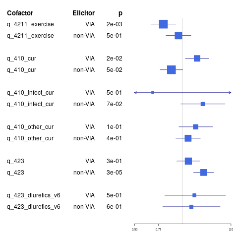

^1^ Department of Dermatology, Venerology and Allergology, Charité – Universitätsmedizin Berlin, corporate member of Freie Universität Berlin, Humboldt-Universität zu Berlin, and Berlin Institute of Health, Charitéplatz 1, 10117 Berlin,

^2^ Department of Dermatology and Allergology, Klinikum der Universität München, Germany 

^3^ Department of Dermatology, Saarland University Hospital, Homburg/Saar, Germany

^4^ Department of Dermatology, University Hospital Basel, Switzerland

**Corresponding author: **
  Prof. Dr. med. M. Worm margitta.worm@charite.de
Phone: +49 30 450 529 005;	  Fax: +49 30 450 529 902

**Keywords:**
  anaphylaxis, adrenaline (epinephrine), beta-blockers, insect venom allergy, yellow-jacket

**Highlights:**
  These are the highlights. 
**Document statistics:**
  Word count, figures, tables, references


<!-- This is the format for text comments that will be ignored during renderings. Do not put R code in these comments because it will not be ignored. -->

```{r setup, echo = FALSE,warning=FALSE,include=F}
knitr::opts_chunk$set(
  collapse = TRUE,
  warning = FALSE,
  message = FALSE,
  echo = FALSE,
  comment = "#>",
  fig.path = "../figures/"
)

devtools::load_all('.',quiet = T) # Or use devtools::load_all('.', quiet = T) if your code is in script files, rather than as functions in the `/R` diretory
###### SETUP

```

# Abstract
Insect-venom elicited anaphylaxis is a common hypersensitivity reaction which may be life-threatening. Using the data from the European Anaphylaxis Registry (11596 cases in total) we identified insect-venom elicited anaphylaxis cases (n = 4482) and analyzed these in comparison to anaphylaxis elicited by other elicitors (n = 7114).

The data show that 68.57% of all insect elicited cases were elicited by yellow jackets, followed by bees (21.86%). The insect venom elicited cases occurred mostly in outdoor places (44.65%) patients' homes (12.87%) or urban places (9.616%). 

Skin, gastrointestinal and respiratory symptoms occurred less frequently in insect elicited cases of anaphylaxis, whereas cardiologic symptoms (with hypotension, collapse, and loss of consciousness) were more frequent.  Intramuscular adrenaline (as a first-line therapy) was administered significantly less often in insect venom elicited cases (4.04%, p < 0.0001). The mortality rate in insect anaphylaxis was comparable (0.156%) to other cases (0.295%, p = 0.174).

Patients who experienced insect-venom anaphylaxis were older (p < 0.0001), more often had concomitant mastocytosis (p < 0.0001) and cardiologic conditions (p < 0.0001) and females more often had concomitant thyroid diseases and less often suffered from a food allergy or atopic dermatitis. 

Symptoms of insect venom anaphylaxis are distinctively different from other reactions, indicating that the therapy of insect elicited cases of anaphylaxis should be considered separately. Indeed we observed different therapeutic patterns in insect elicited cases of anaphylaxis (more antihistaminics but fewer corticosteroids, bronchodilators, and surprisingly - adrenaline). This indicates that the management of insect-venom induced anaphylaxis may be improved and is especially required in patients with concomitant cardiologic conditions and these with hyperreactive mast cells. 


# Introduction

# Methods


The European Anaphylaxis Registry [@Grabenhenrich2016] database from March 2018 wassearched for anaphylaxis cases elicited by insect venom. The flowchart in figure \@ref(fig:flowchart) represents the detailed case-selection process. 

The final database consisted of `r countries %>% summarise(sum(n))` cases of insect elicited anaphylaxis from `r countries %>% summarize(length(n))` countries. Severe reactions were identified based on the definition by NIAID/FAAN [@Sampson2006] and presented with significant hypoxia, hypotension, confusion, collapse and loss of consciousness, or incontinence. 
We compared the frequency of various elicitors, symptoms, and factors known to increase the risk of severe anaphylaxis [@Worm2018] in both groups. We evaluated symptoms, managment and risk factors of insect elicited cases in comparison to other known triggers of anaphylaxis.

<!-- ## Data handling and statisitcs -->
The statistical analysis was performed in the R Statistical Package [@R]. Simple comparison of categorical variables was performed using Fisher's exact test, continuous variables were analyzed using Mann-Whitney U test. We defined statistical significance as α = 0.05. Data along with the analysis script can be accessed at online at....


# Results

## Demographics

```{r}
demoTab
```

```{r, results='asis'}
st_options('bootstrap.css', FALSE)
#rdb %>% select()
ctable(rdb$d_centres_country %>% sapply(function(x){
  as.character(x) %>% factor()
}), rdb$q_340_insects%>% sapply(function(x){
  as.character(x) %>% factor()
}), style = 'rmarkdown',
       useNA = "no",
       prop = "r",
       totals = F,
       round.digits = 1,
dnn = c("Countries","Insects"))

```
```{r}
plot.proportions(rdb, "d_centres_country","q_340_insects")

```

```{r}
cdplot(grouping~d_age,data = rdb)
```

```{r}
mosaicplot(formula = d_severity_rm~d_insect_gr4,data = rdb)
```


## Symptoms
```{r}
testInsectsbinomialTab$symptoms[,-7] %>% knitr::kable()
```

```{r}
plotSympt
```

Patients who underent anaphylaxis due to insect venom more often experienced 
cardiologic symptoms. Especially collapsing due to hypotension was prominently 
more often seen in patient who underwent venom anaphylaxis. This difference was especially visible in children under the age of 18 years. (See the ade adapted symptoms plot). 
We saw prominent differences in association of specific symptoms with eliocitor in cerain age groups. Children under 13 yoears of age showed association with IVIA and vomiting - whereas adults did not. Hypotension collapse was more prominently associated with IVIA in children whereas loss of consciousness in adults. 


```{r}
crammerElicitorBinvsSympt[1:15,] %>% arrange(desc(CV)) %>% knitr::kable()
```


Patients with Insect Venom Allergy had a lot more cardiologic symptoms than anaphylaxis cases that were elicited through other triggers.  
Dizziness, Loss of consciousness hypotension, collapse, Throat tightness and nausea were a lot more often associated with the insect cases. 


Forest plot ! Risk that the symptom will occure given that the reaction was elicited by Insects or not 


## Co-factors
```{r}
testInsectsbinomialTab$cofactors[,-7] %>% knitr::kable()
```


## Managment
```{r}
testInsectsbinomialTab$management[,-7] %>% knitr::kable()
```

```{r}
testInsectsbinomialTab$prophylaxis[,-7] %>% knitr::kable()
```

## Diagnostics 


## Repeated reactions

```{r}
treact <- table(rdb$grouping,rdb$q_160_ever_react)[,1:2] %>% prop.table(1)*100
p <- table(rdb$grouping,rdb$q_160_ever_react)[,1:2] %>% summary() %>% {.$p.value}
```
In general `r treact[1,2]`% patient with insect allergy had experienced anaphylaxis in the past which is less than if the reaction is elicited by other elcitors (`r treact[2,2]`%, p = `r p`).  We documented `r sum(repeated_reaction_in_Reg)` patients with two documented reactions in our registry. 
Out of these `r sum(greter_same)` (`r sum(greter_same)/sum(repeated_reaction_in_Reg)*100`%) had Insect elicited anaphylaxis and in `r greter_same[1]` (`r greter_same[1]/sum(greter_same)*100`) The follwoeing reaction was more severe than before.  

# Discussion

Cardiologic symptoms and hypotensive collapse might be associated with vanom anaphylaxis due to the vaso-vagal reflex. As seen in patients undrgoing blood sampling needles (and probably also insect stings) may elicit a hypotensive response due to extreme emotional distress with bradycardia, limiting the bloodflow to the brain and causing a syncope. This mechanism may contribute to the ongoing histamin-induced vasodialation and may worsen the symptoms of an allergic reaction.


# Conclusion

# Acknowledgements

<!-- The following line inserts a page break when the output is MS Word. For page breaks in PDF, use \newpage on its own line.  -->
##### pagebreak

# References 
<!-- The following line ensures the references appear here for the MS Word or HTML output files, rather than right at the end of the document (this will not work for PDF files):  -->
<div id="refs"></div>

##### pagebreak

# Figures

```{r flow}
knitr::include_graphics("../figures/flow.png")
```

```{r figforestcofactors}
knitr::include_graphics("../figures/figForest.png")
```


```{r figforestcofactorskids}
knitr::include_graphics("../figures/kidsForest.png")
```

```{r figforestcofactorsadults}

```

```{r}
mosaic(d_organ_sum~d_elicitor_gr5,data=rdb)
```

```{r}
mosaic(d_severity_rm~d_elicitor_gr5,data=rdb)
```

```{r}
hypotensionPlot
```

```{r}
cramerPlot
```

```{r}
plot.Cramer(supraCramerFun(data =rdbp,
               vars =c( "q_114",
               "q_112_incontinence",
               "q_114_dizziness",
               "q_112_abdominal_pain",
               "q_114_loss_of_consciousness",
               "q_114_hypotension_collapse_v5",
               "q_114_reductions_of_alertness",
               "q_111_angioedema",
               "q_113_wheezing_expiratory_distress_v5"),
               grouping = "grouping",
               subset = "d_age_gr2"))


```


```{r}
plot.Cramer(cramerFun(data =rdbp,
               vars=c("q_114",
               "q_112_incontinence",
               "q_114_dizziness",
               "q_112_abdominal_pain",
               "q_114_loss_of_consciousness",
               "q_114_hypotension_collapse_v5",
               "q_114_reductions_of_alertness",
               "q_111_angioedema",
               "q_113_wheezing_expiratory_distress_v5"),
               grouping = "grouping"))
```

```{r}
tryptase_plot(rdb)+
  scale_x_log10()

```
