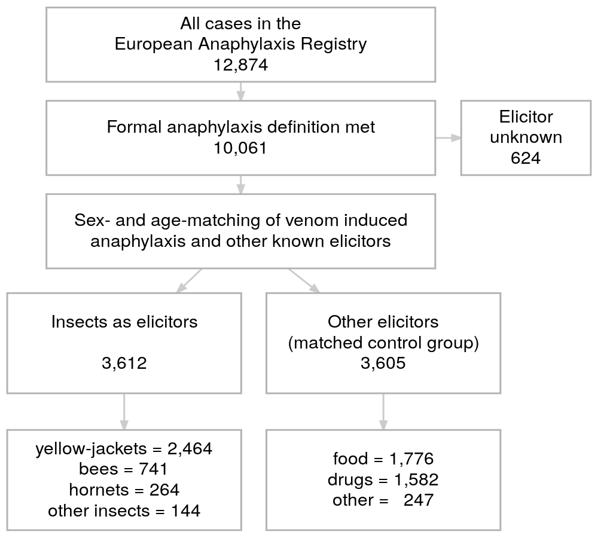
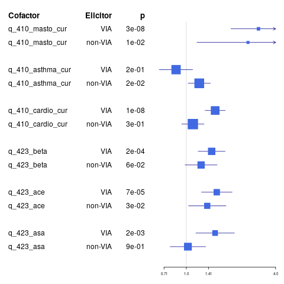

^1^ Department of Dermatology, Venerology and Allergology, Charité – Universitätsmedizin Berlin, corporate member of Freie Universität Berlin, Humboldt-Universität zu Berlin, and Berlin Institute of Health, Charitéplatz 1, 10117 Berlin,

^2^ Department of Dermatology and Allergology, Klinikum der Universität München, Germany 

^3^ Department of Dermatology, Saarland University Hospital, Homburg/Saar, Germany

^4^ Department of Dermatology, University Hospital Basel, Switzerland

**Corresponding author: **
  Prof. Dr. med. M. Worm margitta.worm@charite.de
Phone: +49 30 450 529 005;	  Fax: +49 30 450 529 902

**Keywords:**
  anaphylaxis, adrenaline (epinephrine), beta-blockers, insect venom allergy, yellow-jacket

**Highlights:**
  These are the highlights. 
**Document statistics:**
  Word count, figures, tables, references


<!-- This is the format for text comments that will be ignored during renderings. Do not put R code in these comments because it will not be ignored. -->

```{r setup, echo = FALSE,warning=FALSE,include=F}
knitr::opts_chunk$set(
  collapse = TRUE,
  warning = FALSE,
  message = FALSE,
  echo = FALSE,
  comment = "#>",
  fig.path = "../figures/"
)

devtools::load_all('.',quiet = T) # Or use devtools::load_all('.', quiet = T) if your code is in script files, rather than as functions in the `/R` diretory
###### SETUP

```

# Abstract
Insect-venom elicited anaphylaxis is a common hypersensitivity reaction which may be life-threatening. Using the data from the European Anaphylaxis Registry (11596 cases in total) we identified insect-venom elicited anaphylaxis cases (n = 4482) and analyzed these in comparison to anaphylaxis elicited by other elicitors (n = 7114).

The data show that 68.57% of all insect elicited cases were elicited by yellow jackets, followed by bees (21.86%). The insect venom elicited cases occurred mostly in outdoor places (44.65%) patients' homes (12.87%) or urban places (9.616%). 

Skin, gastrointestinal and respiratory symptoms occurred less frequently in insect elicited cases of anaphylaxis, whereas cardiologic symptoms (with hypotension, collapse, and loss of consciousness) were more frequent.  Intramuscular adrenaline (as a first-line therapy) was administered significantly less often in insect venom elicited cases (4.04%, p < 0.0001). The mortality rate in insect anaphylaxis was comparable (0.156%) to other cases (0.295%, p = 0.174).

Patients who experienced insect-venom anaphylaxis were older (p < 0.0001), more often had concomitant mastocytosis (p < 0.0001) and cardiologic conditions (p < 0.0001) and females more often had concomitant thyroid diseases and less often suffered from a food allergy or atopic dermatitis. 

Symptoms of insect venom anaphylaxis are distinctively different from other reactions, indicating that the therapy of insect elicited cases of anaphylaxis should be considered separately. Indeed we observed different therapeutic patterns in insect elicited cases of anaphylaxis (more antihistaminics but fewer corticosteroids, bronchodilators, and surprisingly - adrenaline). This indicates that the management of insect-venom induced anaphylaxis may be improved and is especially required in patients with concomitant cardiologic conditions and these with hyperreactive mast cells. 


# Introduction

# Methods

The European Anaphylaxis Registry [@Grabenhenrich2016] database from March 2018 was searched for anaphylaxis cases elicited by insect's venom. The flowchart in figure \@ref(fig:flowchart) represents the detailed case-selection process. 

The final database consisted of `r countries %>% summarise(sum(n))` cases of insect elicited anaphylaxis from `r countries %>% summarize(length(n))` countries. Severe reactions were identified based on the definition by NIAID/FAAN [@Sampson2006] and presented with significant hypoxia, hypotension, confusion, collapse and loss of consciousness, or incontinence. 
We compared the frequency of various elicitors, symptoms, and factors known to increase the risk of severe anaphylaxis [@Worm2018] in both groups. We evaluated symptoms, managment and risk factors of insect elicited cases in comparison to other known triggers of anaphylaxis.

<!-- ## Data handling and statisitcs -->
The statistical analysis was performed in the R Statistical Package [@R]. Simple comparison of categorical variables was performed using either Chi^2^ test or Fisher's exact test (where the number of observation in a bin was less then 10), continuous variables were analyzed using Mann-Whitney U test. We defined statistical significance as α = 0.05. Data along with the analysis script can be accessed at online at https://github.com/wolass/venomanaphylaxiscompendium.

# Results

## Demographics

We saw a significant difference in the clinical features of insect anaphylaxis in children and adults. The younger popoulation significantly less often had concomitant conditions (i.e. DM, HT, malignant diseases and mastocytosis), and more often presented with atopic dermatitis, rhinitis and asthma. Therefore, we decided to adjust the analysis for age and sex. 


```{r}
demoTab %>% rbind(demo_age_tab) %>% t() %>%  
  {data.frame(` `=rownames(.),.)} %>%
#   flextable(col_keys = c("X.","female","male","children.adolescents","adults")) 
# topology <- data.frame(col_keys = c("X.","female","male","children.adolescents","adults"),
#                        colB = c("","Sex","Sex","Age","Age"),
#                        ColA = c("","Female","Male","<18",">=18"))
# tempT %>%  
#   set_header_df(mapping = topology,key = "col_keys") %>% 
#   merge_h(part="header") %>% 
#   merge_v() %>% 
#   empty_blanks() %>% 
#   autofit()
knitr::kable(col.names = c("","female","male","<18","adults"),row.names = F)
```


```{r, results='asis'}
# st_options('bootstrap.css', FALSE)
# #rdb %>% select()
# ctable(rdb$d_centres_country %>% sapply(function(x){
#   as.character(x) %>% factor()
# }), rdb$q_340_insects%>% sapply(function(x){
#   as.character(x) %>% factor()
# }), style = 'rmarkdown',
#        useNA = "no",
#        prop = "r",
#        totals = F,
#        round.digits = 1,
# dnn = c("Countries","Insects"))

```

## Temporal distribution of anaphylaxis cases by elicitor.


```{r insectstime, fig.cap="Proportion of anaphylaxis cases elicited by specific insects according to the month in which the reaction occured. Less frequent insects were groupeped together as 'other'. The lowest panel shows the proportion of insect elicited cases to ceses elicited by other triggers.", fig.height=6,fig.width=4}
#### plot MOR#####
plot_MOR <- gridExtra::grid.arrange(
  #cowplot::plot_grid(
  rdbp %>%
  select(b_reactiondate,grouping,q_340_insects,d_centres_country) %>%
  mutate(MOR = substr(b_reactiondate,4,5)) %>%
  filter(!is.na(q_340_insects),MOR!="00") %>%
  ggplot(aes(MOR,fill=q_340_insects))+
  geom_bar(position = "fill")+
    theme_classic()+
  theme(axis.text.x = element_blank(),
        axis.title.x = element_blank(),
        axis.ticks.x = element_blank(),
        legend.position = "none"
        )+
  ylab("Proportion"),
rdbp %>%
  select(b_reactiondate,grouping,q_340_insects,d_centres_country) %>%
  mutate(MOR = substr(b_reactiondate,4,5)) %>%
  filter(!is.na(q_340_insects),MOR!="00") %>%
  ggplot(aes(MOR,fill=q_340_insects))+
  geom_bar()+
  theme_classic()+
  labs(fill="Insect",x = "Month of the year")+
  theme(axis.text.x = element_blank(),
        axis.title.x = element_blank(),
        axis.ticks.x = element_blank(),
        legend.position = c(0.01,.98),
        legend.justification = c(0,1)),
rdbp %>%
  select(b_reactiondate,grouping,d_elicitor_gr5,d_centres_country) %>%
  mutate(MOR = substr(b_reactiondate,4,5),
         d_elicitor_gr5 = relevel(d_elicitor_gr5, "insects")) %>%
  filter(!is.na(grouping),MOR!="00") %>%
  group_by(MOR,grouping) %>%
  summarize(n = n()) %>%
  group_by(MOR) %>%
  summarise(prop = n[1]/sum(n)) %>%
  ggplot(aes(MOR,prop))+
  geom_bar(stat="identity")+
  theme_classic()+
  labs(x = "Month of the year",y = "Fraction of insect elicited ANA"),
  #theme(legend.position = c(0.01,.98),
  #      legend.justification = c(0,1)),
heights = c(0.4,1,0.5),
ncol = 1
)
```

Insect venom elicited anaphylaxis in contrast to other elicitors showed a significant seasonal fluctuation and was most frequently reported from May till October. Their proportion to other cases during the summer seasons reached 60 % and was as under 1% of cases during winter. Yellow-jacket was the most prominent causing-insect reported in these cases foolowed by bee (Fig \@ref(fig:insectstime)).  


```{r insectsgeo, fig.cap="Proportion of anaphylaxis cases elicited by specific insects in reporting countries. Less frequent insects were groupeped together as 'other'. Countries which reported less than 20 cases of anaphylaxis due to insect venom were not illustrated in this figure."}
plot.proportions(rdb, "d_centres_country","q_340_insects",5)+
  labs(x = "Country",y="Proportion of IVA cases",fill = "Species")
```

The Figure \@ref(fig:insectsgeo) shows the distribution of insects according to the geographic area (countries). The most common elicitor among most of the countries were yellow-jackets. Switzerland had significantly more reactions to bees than Germany. Centers from Italy reported more cases elicited by hornets in comparison to other countries.

```{r age}
cdplot(rdb$grouping~as.numeric(rdb$d_age))
```

Cases of IVA were more requent in oder patients. Children suffered mainly form food elicited anaphylaxis. Therefore we adjusted the anlysis apropriately for age. 

```{r}
mosaicplot(formula = d_severity_rm~d_insect_gr4,data = rdb)
rdb %>% filter(!is.na(d_insect_gr4)) %>% 
ggplot(aes(d_insect_gr4,fill=factor(d_severity_rm)))+
  geom_bar(position="fill")+
  facet_grid(.~d_age_gr2)
```


## Symptoms
```{r}
testInsectsbinomialTab$symptoms[,-7] %>% knitr::kable()
```

```{r}
plotSympt
```

Patients who underent anaphylaxis due to insect venom more often experienced 
cardiologic symptoms. Especially collapsing due to hypotension was prominently 
more often seen in patient who underwent venom anaphylaxis. This difference was especially visible in children under the age of 18 years. (See the ade adapted symptoms plot). 
We saw prominent differences in association of specific symptoms with eliocitor in cerain age groups. Children under 13 yoears of age showed association with IVIA and vomiting - whereas adults did not. Hypotension collapse was more prominently associated with IVIA in children whereas loss of consciousness in adults. 


```{r}
crammerElicitorBinvsSympt[1:15,] %>% arrange(desc(CV)) %>% knitr::kable()

crammerElicitorBinvsSympt[1:15,] %>% arrange(desc(CV)) %>%
  filter(CV<0.3,
         CV>0.15) %>% 
  ggplot(aes(reorder(var,-CV),CV))+
  geom_col()+
  theme(axis.text.x = element_text(angle=90))
```


Patients with Insect Venom Allergy had a lot more cardiologic symptoms than anaphylaxis cases that were elicited through other triggers.  
Dizziness, Loss of consciousness hypotension, collapse, Throat tightness and nausea were a lot more often associated with the insect cases. 


Forest plot ! Risk that the symptom will occure given that the reaction was elicited by Insects or not 


## Co-factors
```{r}
testInsectsbinomialTab$cofactors[,-7] %>% knitr::kable()

testInsectsbinomialTab$cofactors[,-7] %>%
  tidyr::gather(value ="Proportion",
         key="Group",
         4:5) %>% 
  ggplot(aes(reorder(variableName,-Proportion),Proportion,fill=Group))+
  geom_bar(stat="identity",position="dodge")+
  theme(axis.text.x=element_text(angle=90))
```


### ACE-I
Ruef wrote in 2009 that the use of ACE I increases the risk of a severe reaction. 

```{r}
data$q_423_ace <- yesonly(data$q_423_ace)

wilcox.test(q_116_VAS_v7~q_423_ace,data = data)
data %>% 
  filter(d_elicitor_gr5=="insects") %>% 
ggplot(aes(q_423_ace,q_116_VAS_v7))+
  geom_violin()

data %>% 
  filter(d_elicitor_gr5=="insects") %>% 
group_by(q_423_ace) %>% 
  summarise(medianVAS=median(q_116_VAS_v7,na.rm=T),
            IQRVAS = IQR(q_116_VAS_v7,na.rm=T))


wilcox.test(ANAscore~q_423_ace,data = data %>% 
  filter(d_elicitor_gr5=="insects") 
)

data %>% 
  filter(d_elicitor_gr5=="insects") %>% 
ggplot(aes(q_423_ace,ANAscore))+
  geom_violin()
data %>% 
  filter(d_elicitor_gr5=="insects") %>% 
 group_by(q_423_ace) %>% 
  summarise(medianANAscore=median(ANAscore,na.rm=T),
            IQRANAscore = IQR(ANAscore,na.rm=T))

cowplot::plot_grid(
data %>% 
  filter(d_elicitor_gr5=="insects") %>% 
ggplot(aes(q_423_ace,q_116_VAS_v7))+
  geom_boxplot(),
data %>% 
  filter(d_elicitor_gr5=="insects") %>% 
ggplot(aes(q_423_ace,ANAscore))+
  geom_boxplot()
)

```

### Beta blockers 
cardioselectivity??????
```{r}
data$q_423_beta <- yesonly(data$q_423_beta)

wilcox.test(q_116_VAS_v7~q_423_beta,data = data)
data %>% 
  filter(d_elicitor_gr5=="insects") %>% 
ggplot(aes(q_423_beta,q_116_VAS_v7))+
  geom_violin()

data %>% 
  filter(d_elicitor_gr5=="insects") %>% 
group_by(q_423_beta) %>% 
  summarise(medianVAS=median(q_116_VAS_v7,na.rm=T),
            IQRVAS = IQR(q_116_VAS_v7,na.rm=T))


wilcox.test(ANAscore~q_423_beta,data = data %>% 
  filter(d_elicitor_gr5=="insects") 
)

data %>% 
  filter(d_elicitor_gr5=="insects") %>% 
ggplot(aes(q_423_beta,ANAscore))+
  geom_violin()
data %>% 
  filter(d_elicitor_gr5=="insects") %>% 
 group_by(q_423_beta) %>% 
  summarise(medianANAscore=median(ANAscore,na.rm=T),
            IQRANAscore = IQR(ANAscore,na.rm=T))

cowplot::plot_grid(
data %>% 
  filter(d_elicitor_gr5=="insects") %>% 
ggplot(aes(q_423_beta,q_116_VAS_v7))+
  geom_boxplot(),
data %>% 
  filter(d_elicitor_gr5=="insects") %>% 
ggplot(aes(q_423_beta,ANAscore))+
  geom_boxplot()
)

```


### mast cell burden - mastocytosis 

```{r}
data$q_410_masto_cur %<>%  yesonly()

wilcox.test(q_116_VAS_v7~q_410_masto_cur,data = data)
data %>% 
  filter(d_elicitor_gr5=="insects") %>% 
ggplot(aes(q_410_masto_cur,q_116_VAS_v7))+
  geom_violin()

data %>% 
  filter(d_elicitor_gr5=="insects") %>% 
group_by(q_410_masto_cur) %>% 
  summarise(medianVAS=median(q_116_VAS_v7,na.rm=T),
            IQRVAS = IQR(q_116_VAS_v7,na.rm=T))


wilcox.test(ANAscore~q_410_masto_cur,data = data %>% 
  filter(d_elicitor_gr5=="insects") 
)

data %>% 
  filter(d_elicitor_gr5=="insects") %>% 
ggplot(aes(q_410_masto_cur,ANAscore))+
  geom_violin()
data %>% 
  filter(d_elicitor_gr5=="insects") %>% 
 group_by(q_410_masto_cur) %>% 
  summarise(medianANAscore=median(ANAscore,na.rm=T),
            IQRANAscore = IQR(ANAscore,na.rm=T))

cowplot::plot_grid(
data %>% 
  filter(d_elicitor_gr5=="insects") %>% 
ggplot(aes(q_410_masto_cur,q_116_VAS_v7))+
  geom_boxplot(),
data %>% 
  filter(d_elicitor_gr5=="insects") %>% 
ggplot(aes(q_410_masto_cur,ANAscore))+
  geom_boxplot()
)

```

```{r}
cowplot::plot_grid(
data %>% 
  filter(d_elicitor_gr5=="insects") %>% 
ggplot(aes(q_212_tryptase_value_v5,q_116_VAS_v7))+
  geom_point()+
  scale_x_log10(),
data %>% 
  filter(d_elicitor_gr5=="insects") %>% 
ggplot(aes(q_212_tryptase_value_v5,ANAscore))+
  geom_point()+
  scale_x_log10()
)


cowplot::plot_grid(
data %>% 
  filter(d_elicitor_gr5=="insects") %>% 
  mutate(typ_cat=ifelse(q_212_tryptase_value_v5<8,
                  "low",
                  "high")) %>% 
  filter(!is.na(typ_cat)) %>% 
  ggplot(aes(typ_cat,q_116_VAS_v7))+
  geom_boxplot(),
data %>% 
  filter(d_elicitor_gr5=="insects") %>% 
  mutate(typ_cat=ifelse(q_212_tryptase_value_v5<8,
                  "low",
                  "high")) %>% 
  filter(!is.na(typ_cat)) %>% 
  ggplot(aes(typ_cat,ANAscore))+
  geom_boxplot(),
data %>% 
  filter(d_elicitor_gr5=="insects",
         !is.na(d_severity_rm)) %>% 
  mutate(typ_cat=ifelse(q_212_tryptase_value_v5<8,
                  "low",
                  "high")) %>% 
  group_by(d_severity_rm,typ_cat) %>% 
  filter(!is.na(typ_cat)) %>% 
    summarize(n = n()) %>% 
  ggplot(aes(typ_cat,n,fill=d_severity_rm))+
  geom_bar(stat="identity",position= "fill"),
data %>% 
  filter(d_elicitor_gr5!="insects") %>% 
  mutate(typ_cat=ifelse(q_212_tryptase_value_v5<8,
                  "low",
                  "high")) %>% 
  filter(!is.na(typ_cat)) %>% 
  ggplot(aes(typ_cat,q_116_VAS_v7))+
  geom_boxplot(),
data %>% 
  filter(d_elicitor_gr5!="insects") %>% 
  mutate(typ_cat=ifelse(q_212_tryptase_value_v5<8,
                  "low",
                  "high")) %>% 
  filter(!is.na(typ_cat)) %>% 
  ggplot(aes(typ_cat,ANAscore))+
  geom_boxplot(),
data %>% 
  filter(d_elicitor_gr5!="insects",
         !is.na(d_severity_rm)) %>% 
  mutate(typ_cat=ifelse(q_212_tryptase_value_v5<8,
                  "low",
                  "high")) %>% 
  group_by(d_severity_rm,typ_cat) %>% 
  filter(!is.na(typ_cat)) %>% 
    summarize(n = n()) %>% 
  ggplot(aes(typ_cat,n,fill=d_severity_rm))+
  geom_bar(stat="identity",position= "fill")
)

```

Here put the mastocytosis and baseline serum tryptase as the evaluation of severe risk
Here it is crucial to compare to even these reactions that had nearly no reactions

### Model the risk of severity of a severe reaction in IVA

USe the model from our previous paper
```
```


## Managment
```{r}
testInsectsbinomialTab$management[,-7] %>% knitr::kable()
testInsectsbinomialTab$management[,-7]%>%
  tidyr::gather(value ="Proportion",
         key="Group",
         4:5) %>% 
  ggplot(aes(reorder(variableName,-Proportion),Proportion,fill=Group))+
  geom_bar(stat="identity",position="dodge")+
  theme(axis.text.x=element_text(angle=90))+
  geom_text(aes(y=0.5,label=reorder(signif(pval,2),-Proportion)),angle=90)
```

## Diagnostics 


## Repeated reactions

```{r}
treact <- table(rdb$grouping,rdb$q_160_ever_react)[,1:2] %>% prop.table(1)*100
p <- table(rdb$grouping,rdb$q_160_ever_react)[,1:2] %>% summary() %>% {.$p.value}
```
In general `r treact[1,2]`% patient with insect allergy had experienced anaphylaxis in the past which is less than if the reaction is elicited by other elcitors (`r treact[2,2]`%, p = `r p`).  We documented `r sum(repeated_reaction_in_Reg)` patients with two documented reactions in our registry. 
Out of these `r sum(greter_same)` (`r sum(greter_same)/sum(repeated_reaction_in_Reg)*100`%) had Insect elicited anaphylaxis and in `r greter_same[1]` (`r greter_same[1]/sum(greter_same)*100`) The follwoeing reaction was more severe than before.  


### Do we know how mnay beekeepers were in our dataset?
We were unable to estimate the fraction of cases that were elicited in bee-keepers as this information is not asked in the questionnaire. 

### Hypothesis: Wasp stings are more severe than bee stings
We previously saw that refractory anaphylaxis cases come from bees. Here we see no difference in the severity of cases elicited by bees and wasps (in the RM). 

```{r}
ana_outcome_matched <- function(data = data4,
         outcome = "d_severity_rmr",
         matching_var = "q_340_insects",
         confounders_cat = c("b_sex", "cc_cardio"),
         confounders_int = c("d_age"),
         selected_predictors = c(1:4)
         ){
  possible_outcomes <- c("d_severity_rm",
                         "d_severity_rmr",
                         "severity_brown",
                         "q_116_VAS_v7",
                         "ANAscore")
  predictors <- c(matching_var, confounders_cat,confounders_int)
  df <- data %>% # first get the data frame
   filter(!!as.name(matching_var) %in% c("yellow jacket", "bee")) %>% 
   select(!!!matching_var,
          !!!outcome,
          !!!confounders_cat,
          !!!confounders_int
          ) %>%
          {.[complete.cases(.),]}
  ### we need to match the cases now to the first level of theoutcome variable
  ref_level <- levels(df[,matching_var] %>% droplevels())
  matched <- df %>% 
    mutate(match = ifelse(!!as.name(matching_var)==ref_level[1],T,F),
           out=ifelse(!!as.name(outcome)=="severe",1,0)) %>% 
    matchit(formula = as.formula(
      paste("match ~ ",paste0(confounders_cat),"+", paste0(confounders_int,collapse = " + ")))) %>% 
    match.data() 
  ## IFELSE
  if(outcome %in% possible_outcomes[c(2,3)]){
    plot <- matched %>% 
      ggplot(aes(!!as.name(matching_var),
               fill = !!as.name(outcome)))+
      geom_bar()+
      facet_grid(reformulate(confounders_cat[1],confounders_cat[2]))
  
    fit <- glm(as.formula(paste0(
      "out ~ ",paste0(predictors[selected_predictors], collapse = " + ")
    )),data= matched,family= "binomial")
  } else if (outcome %in% possible_outcomes[c(1,4,5)]){
     plot <- matched %>% 
      ggplot(aes(!!as.name(matching_var),
               y = !!as.name(outcome)))+
      geom_boxplot()+
      facet_grid(reformulate(confounders_cat[1],confounders_cat[2]))
  
    fit <- glm(as.formula(paste0(
      outcome, " ~ ", paste0(predictors[selected_predictors], collapse = " + "))),
             data = matched)
  }
  
  return(list(mtched_df = matched,
              ref_level = ref_level,
              fit = fit,
              plot = plot)) 
}

possible_outcomes <- c("d_severity_rm",
                         "d_severity_rmr",
                         "severity_brown",
                         "q_116_VAS_v7",
                         "ANAscore")

output_severity <- lapply(possible_outcomes,
                         function(x){
                         ana_outcome_matched(data = data4,
                            outcome = x,
                            matching_var = "q_340_insects",
                            confounders_cat = c("b_sex", "cc_cardio"),
                            confounders_int = c("d_age"),
                            selected_predictors = c(1:4))
                           }
)


do_cof_tab <- function(x){
  output_severity[[x]]$fit %>% summary() %>% {.$coefficients}%>% tidy() %>% as.matrix()
}

temp <- lapply(1:5,do_cof_tab) %>% do.call(what = rbind) %>%
                          as_tibble() %>%
  {mutate(.,
         Estimate = as.numeric(Estimate),
         Pr...t.. = as.numeric(Pr...t..)
  )} %>%
          {cbind(.,outcome = lapply(possible_outcomes,
                          rep,
                          nrow(.)/5) %>% unlist)
          } %>% 
           filter(.rownames!="(Intercept)")
gridExtra::grid.arrange(output_severity[[2]]$plot,
                        output_severity[[3]]$plot,
                        output_severity[[1]]$plot,
                        output_severity[[4]]$plot,
                        output_severity[[5]]$plot,
                        temp %>% 
  ggplot(aes(.rownames,Pr...t.., color=outcome))+
  geom_segment(x=0.5,xend=4.5,y=log10(0.05),yend=log10(0.05))+
  scale_y_log10()+
  geom_jitter()+
  theme(axis.text.x = element_text(angle=40, hjust=1))
  )#+
  #geom_line(aes(group=outcome))
```

Based on the above graphs of patients matched according to sex and age we cannot say that the severity of their reaction differ between yellow-jackets and bees in any of the models except ANAscore - where yellow jacket were linked to  a slightly more severe reaction.

But in the ANAscore variable it shows up to be significant ! Yellowjackets stings are more severe than the bee stings. This is however very hard to compare to refractory cases. Maybe we can use the refractory case identifier to say in which group we see more refractory cases? 


### Increased BTSC develops in the normal range <8


```{r}
output_severity <- lapply(possible_outcomes,
                         function(x){
                         ana_outcome_matched(data = data4,
                            outcome = x,
                            matching_var = "q_340_insects",
                            confounders_cat = c("tryp_cat", "cc_cardio"),
                            confounders_int = c("d_age"),
                            selected_predictors = c(1,2,4))
                           }
)


do_cof_tab <- function(x){
  output_severity[[x]]$fit %>% summary() %>% {.$coefficients}%>% tidy() %>% as.matrix()
}

temp <- lapply(1:5,do_cof_tab) %>% do.call(what = rbind) %>%
                          as_tibble() %>%
  {mutate(.,
         Estimate = as.numeric(Estimate),
         Pr...t.. = as.numeric(Pr...t..)
  )} %>%
          {cbind(.,outcome = lapply(possible_outcomes,
                          rep,
                          nrow(.)/5) %>% unlist)
          } %>% 
           filter(.rownames!="(Intercept)")
gridExtra::grid.arrange(output_severity[[2]]$plot,
                        output_severity[[3]]$plot,
                        output_severity[[1]]$plot,
                        output_severity[[4]]$plot,
                        output_severity[[5]]$plot,
                        temp %>% 
  ggplot(aes(.rownames,Pr...t.., color=outcome))+
  geom_segment(x=0.5,xend=4.5,y=log10(0.05),yend=log10(0.05))+
  scale_y_log10()+
  geom_jitter()+
  theme(axis.text.x = element_text(angle=40, hjust=1))
  )
```

Based on the above we see that the lower tryptase significantly decreased the severity of 


### Mastocytosis

### Older Age

### ACE - I

### previous reactions (severe)

### Male sex

### Beta blockers and CARDIOSELECTIVE BLOCKERS

### Evaluate the pediatric population separately

### Number of SAR during VIT compare to other hypos
#### Compare bee sit to wasp sit for AEs
#### correlate the tryptase value with SIT types and severity
### 
they used generalized aditive models (package GAM?)
Also ROC curves for confirmation

# Discussion

Cardiologic symptoms and hypotensive collapse might be associated with vanom anaphylaxis due to the vaso-vagal reflex. As seen in patients undrgoing blood sampling needles (and probably also insect stings) may elicit a hypotensive response due to extreme emotional distress with bradycardia, limiting the bloodflow to the brain and causing a syncope. This mechanism may contribute to the ongoing histamin-induced vasodialation and may worsen the symptoms of an allergic reaction.


# Conclusion

# Acknowledgements

<!-- The following line inserts a page break when the output is MS Word. For page breaks in PDF, use \newpage on its own line.  -->
##### pagebreak

# References 
<!-- The following line ensures the references appear here for the MS Word or HTML output files, rather than right at the end of the document (this will not work for PDF files):  -->
<div id="refs"></div>

##### pagebreak

# Figures

```{r flow}

```

```{r figforestcofactors}

```

```{r figforestcofactorskids}

```

```{r figforestcofactorsadults}
knitr::include_graphics("../figures/adultsForest.png")
```

```{r}
mosaic(d_organ_sum~d_elicitor_gr5,data=rdb)
```

```{r}
mosaic(d_severity_rm~d_elicitor_gr5,data=rdb)
```

```{r}
hypotensionPlot
```

```{r}
cramerPlot
```

```{r}
plot.Cramer(supraCramerFun(data =rdbp,
               vars =c( "q_114",
               "q_112_incontinence",
               "q_114_dizziness",
               "q_112_abdominal_pain",
               "q_114_loss_of_consciousness",
               "q_114_hypotension_collapse_v5",
               "q_114_reductions_of_alertness",
               "q_111_angioedema",
               "q_113_wheezing_expiratory_distress_v5"),
               grouping = "grouping",
               subset = "d_age_gr2"))


```


```{r}
plot.Cramer(cramerFun(data =rdbp,
               vars=c("q_114",
               "q_112_incontinence",
               "q_114_dizziness",
               "q_112_abdominal_pain",
               "q_114_loss_of_consciousness",
               "q_114_hypotension_collapse_v5",
               "q_114_reductions_of_alertness",
               "q_111_angioedema",
               "q_113_wheezing_expiratory_distress_v5"),
               grouping = "grouping"))
```

```{r}
tryptase_plot(rdb)+
  scale_x_log10()+
  facet_grid(~d_age_gr2)

```

```{r reactionmonthincountries, fig.cap="Proportional insect venom induced anaphylaxis to specific insects during a year according to countries.", fig.height=8,fig.width=5}
plot_MOR+
  facet_grid(d_centres_country~.)
```

```{r}
plot_MOR
```

```{R adrenalineuse, fig.cap = "The proportion of insect venom elicited anaphylaxis cases that were treated with adrenaline in comparison to other elicitors."}
F2$plot2
```
